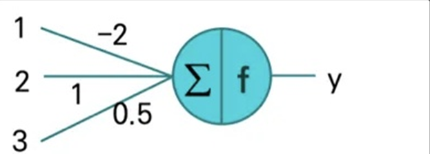
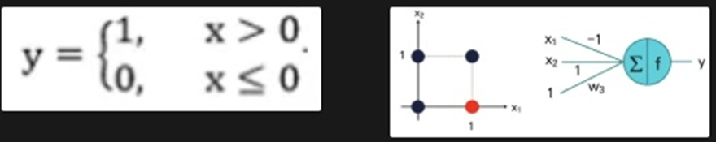

# Quiz 1
>Q1) Neural Network는 여러 개의 perceptron으로 구성된다. 
O

>Q2) Neural Network의 connection weight의 값은 모두 달라야만 한다.
X - 같을수도 있다.

>Q3) Connection weight은 해당 입력 값과 더해진다
X - 곱해야 한다. 

>Q4) Neural network는 일반적으로 layer 구조를 갖는다.
O

>Q5) 아래 perceptron의 출력 값을 구하시오. Activation function으로 hard limit 함수를 사용한다.

Σ = 1.5 이므로 결과값인 y는 1이 출력된다. 

# Quiz 2

>Q1) Perceptron은 선형으로 분리 가능한 문제를 해결할 수 있다.
O

>Q2) AND 연산은 neural network으로 해결할 수 있다.
O

>Q3) XOR 연산은 perceptron으로 해결할 수 있다.
O

>Q4) Layer가 3개인 neural network은 임의의 함수를 모델링할 수 있다.
O

>Q5) 주어진 perceptron이 아래의 이진논리 연산을 수행할 수 있는 w3의 범위를 결정하시오.
Activation Function으로는 아래 Hard Limit 함수를 사용한다.

>1. 0 < w3 ≤ 1
>2. 0 < w3 < 1
>3. 0 < w3 ≤ 2
>4. 1 ≤ w3 < 2
x1과 x2가 각각 1, 0일 때 y는 0이어야 한다. 즉, Σ는 0보다 작거나 같아야 한다.
-1+0+w3 ≤ 0
w3 ≤ 1
x1과 x2가 각각 0, 1일 때 y는 1이어야 한다. 즉, Σ는 0보다 커야 한다.
0+1+w3 > 0
w3 > -1
x1과 x2가 각각 1, 1일 때 y는 1이어야 한다. 즉, Σ는 0보다 커야 한다.
-1+1+w3 > 0
w3 > 0
x1과 x2가 각각 0, 0일 때 y는 1이어야 한다. 즉, Σ는 0보다 커야 한다.
0+0+w3 > 0
w3 > 0
그러므로, 0< w3 ≤ 1 이다. 답은 1번