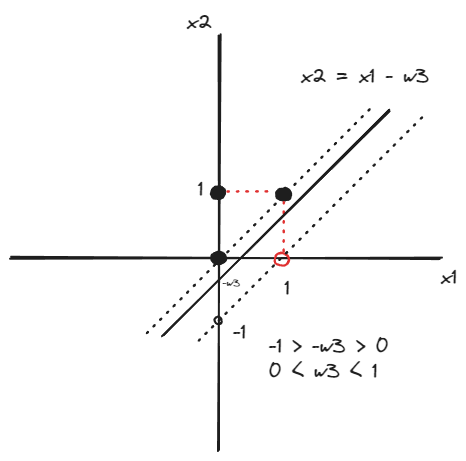

### Q1-1 Neural Network는 여러개의 Perceptron으로 구성된다. 
(O)
### Q1-2 Neural Network의 connection weight의 값은 모두 달라야만 한다. 
(X)
뉴럴 네트워크의 연결 가중치는 같은 경우도 있고 다른 경우도 있다!
### Q1-3 Connection weight은 해당 입력 값과 더해진다. 
(X), 연결 가중치의 값은 해당 입력 값과 곱해지게 된다!
### Q1-4 Neural network는 일반적으로 layer 구조를 갖는다. 
(O) 
### Q1-5 주어진 perceptron의 출력 값을 구하시오
1,  1 * -2 + 2 * 1 + 3 * 0.5 = 1.5  summation이 0보다 크므로 출력값은 1이다.

### Q2-1 Perceptron은 선형으로 분리가능한 문제를 해결할 수 있다 
(O)
### Q2-2 AND 연산은 neural network으로 해결할 수 있다 
(O)
### Q2-3 XOR 연산은 perceptron으로 해결할 수 있다
(X), XOR 연산은 단일 퍼셉트론으로 해결이 불가하며 멀티레이어 퍼셉트론을 사용해야한다 
### Q2-4 Layer가 3개인 neural network은 임의의 함수를 모델링 할 수 있다 
(O)
### Q2-5 주어진 perceptron이 아래의 이진 논리 연산을 수행할 수 있는 w3의 범위를 결정하시오
 주어진 논리 연산을 수행하려면 그래프가 해당 범위 내에 존재해야 한다!
