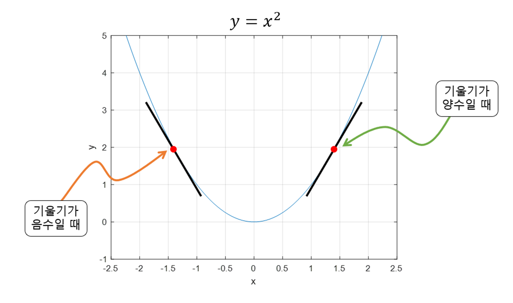

## 경사하강법

- 기울기가 낮아지는 방법으로 학습

- 해당 그림의 경우에서 최소인 기울기를 학습하고자 했을때
- 랜덤 포인트에서 시작하여,
- 기울기가 음수일 때는 오른쪽으로
- 기울기가 양수일때는 왼쪽으로 이동해야 할 것.
- 해당 방법은 극솟값을 발견하게 되면 해당 극솟값이 함수 전체의 최솟값이라 간주해버린다.. 다른 부분에 실제로 최솟값이 있는지 모를 것

- 하이퍼 파라미터: 사용자가 수정 가능한 매개변수(ex> 학습률)
    - L:손실함수
    - 학습률 * 기울기를 빼주기 때문에 학습률이 기울기에 따라 달라지게 된다…
    - 학습률(에타값)을 크게 해줬을 때 최소값에 빠르게 수렴할 수 있지만 복잡해진다…
    - 하지만 글로벌한 최솟값에 도달하기 쉽게 해줄 수도 있다,
    - 에타값을 작게 줬을 때는 발산 할 위험은 없지만, 로컬적인 최솟값에 갇혀버린다, 자원, 시간 낭비가 크다고도 할 수 있다
    
    ⇒ 적절한 스텝 사이즈를 찾아야 할 것!
    
    - 모든 경우에서 전역 해에 도달하지는 못하고 지역 해에 머무르는 경우도 다반사이다..
- Error Back Propagation
    - 딥러닝 vs 머신러닝을 가르는 중요한 요소
    - 컴퓨터가 각 노드의 가중치를 알아서 수정하도록 함!
    - 출력값에서 계산된 오차(error) 를 기준으로, 그 영향을 거꾸로 각 층에 전파하면서 가중치를 수정함
- 과정
    - 피드-포워드(입력을 넣고 출력을 나오기까지 하는 과정), (순전파)
    - 에러: 원래 정답과 모델이 풀어본 정답과의 오차.
    - 에러를 더해서 이전 노드에 더해준다(영향을 끼친 모든 노드를)